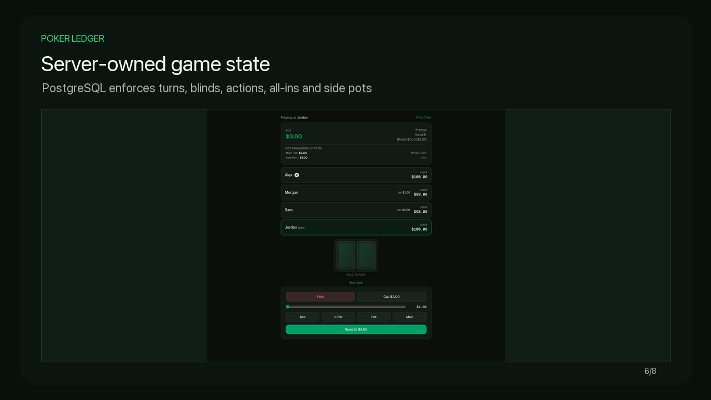
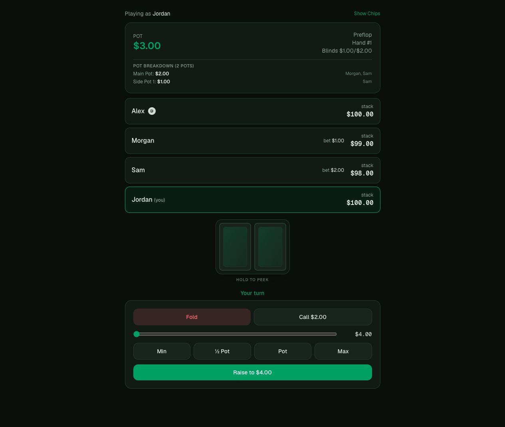
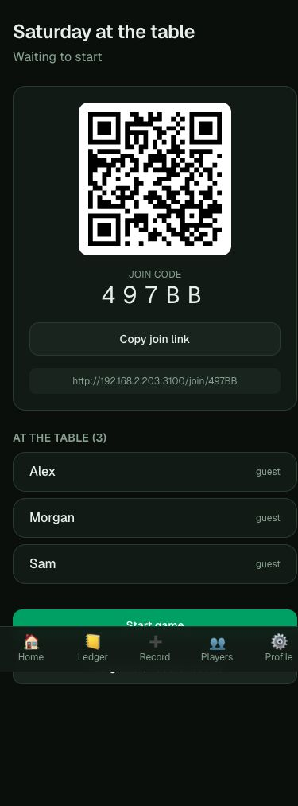
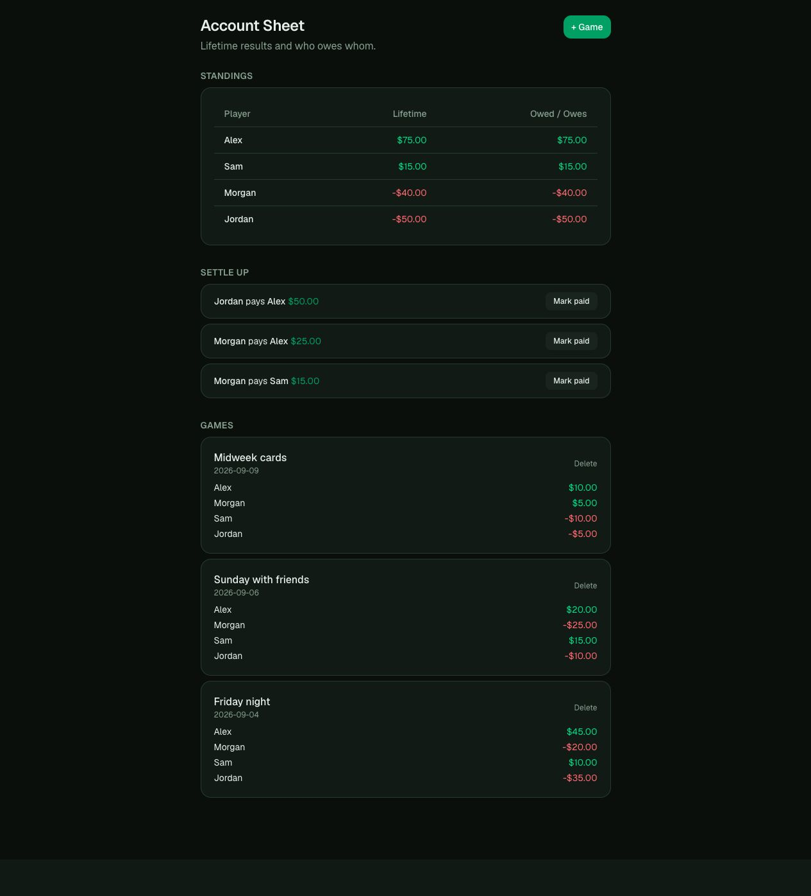

# Poker Ledger

A mobile-first app for running home poker games and keeping track of who owes whom. Built with **Next.js 16, React 19, TypeScript, Tailwind CSS 4, and Supabase/PostgreSQL**.

[Watch the captioned demo](docs/demo/poker-ledger-demo.mp4) · [Architecture and tradeoffs](docs/architecture.md) · [Run locally](#run-locally)

[](docs/demo/poker-ledger-demo.mp4)

## What it does

- **Organize a game:** share a join code or QR code, admit guests, and keep the lobby synchronized.
- **Play together:** track blinds, turn order, bets, all-ins and side pots across browser sessions. Use physical cards or the digital dealer.
- **Resolve a hand:** integrate `pokersolver` to evaluate digital cards at showdown; the host confirms and awards the pots.
- **Settle up:** close a completed game into the ledger, view lifetime profit/loss, and record suggested payments.
- **Use it on a phone:** responsive controls, hold-to-peek cards, and a home-screen manifest. Internet access is required; offline play is not implemented.

<table>
<tr>
<td width="70%"></td>
<td width="30%"></td>
</tr>
</table>



## Engineering highlights

| Concern | Implementation |
| --- | --- |
| Frontend and server boundary | Next.js App Router, React client components for live interactions, Server Actions for ledger workflows |
| Shared game state | Supabase Realtime subscriptions refresh database-backed snapshots; reads are serialized to avoid older responses overwriting newer state |
| Game rules | PostgreSQL functions enforce betting actions; hand locks serialize concurrent actions and payouts |
| Access control | Supabase Auth, row-level policies, explicit RPC permissions, and private tables for hole cards and the undealt deck |
| Financial consistency | A transactional closeout validates ownership, roster coverage, unique ledger mappings and balanced totals; unfinished hands cannot be closed |
| Verification | An 11-scenario engine harness plus permission and closeout regressions, including rollback and concurrent submissions |

The host is a trusted game administrator with manual controls. This is a home-game project, not an adversarial real-money poker platform. The shuffle uses PostgreSQL `random()`. Settlement suggestions use a greedy algorithm and do not guarantee the mathematically smallest number of payments.

## Run locally

Requires Node.js, npm and a Supabase development project.

```bash
npm install
cp .env.local.example .env.local
```

Set the project URL and publishable key in `.env.local`:

```dotenv
NEXT_PUBLIC_SUPABASE_URL=https://your-project-ref.supabase.co
NEXT_PUBLIC_SUPABASE_PUBLISHABLE_KEY=your-publishable-key
```

The legacy `NEXT_PUBLIC_SUPABASE_ANON_KEY` is also supported. Never put a service-role key in a `NEXT_PUBLIC_*` variable.

Link **your own** Supabase project and apply the committed migrations:

```bash
npx supabase login
npx supabase link --project-ref YOUR_PROJECT_REF
npm run db:push
```

In Supabase Auth, enable anonymous sign-ins for guest joining. For the test harness and demo seed in a development project, disable email confirmation so the synthetic test accounts can sign in. Configure appropriate confirmation and abuse controls separately before public use.

```bash
npm run dev
```

Open `http://localhost:3000`. To join from a phone on the same Wi-Fi, open the host app through your computer's LAN address first; its QR code uses that address. `localhost` on a phone points to the phone, not your computer.

## Verify

```bash
npm run lint
npm run build
npm run test:engine
npm run test:security
```

The integration suites use the configured Supabase project. Run them against a development project: they create test Auth accounts and temporary games. Test games are removed on successful engine runs; the security suite cleans its games and ledger members in `finally`. Auth accounts remain and can be removed from the development project's dashboard.

See [validation notes](docs/validation.md) for the checks performed for this demo.

## Reproduce the demo

```bash
npm run demo:seed
npm run build
npm run start -- --port 3100
```

The seed creates a dedicated demo account, four fictional ledger members, three balanced historical games and a digital-card lobby. Its credentials and fixture IDs are saved in the gitignored `.env.demo.local.json` file with owner-only permissions. Re-running replaces only the recorded fixtures for this dedicated account.

Open that local file to obtain the demo login. Use a separate browser profile or a different local hostname for the guest session. Do not commit credentials or share this writable account publicly.

[Demo guide and captions](docs/demo/README.md) · [Resume wording](docs/resume.md)

## Project map

- `app/` — pages, server-rendered data and Server Actions
- `components/live/` — table, betting controls, timer and realtime state
- `lib/ledger.ts` — balances and suggested settlements
- `supabase/migrations/` — schema, policies, betting engine and closeout transaction
- `scripts/` — integration tests and fictional demo seed

## Deployment

The recorded demo runs locally against Supabase. No public frontend is currently deployed. To deploy, import the repository into Vercel and configure the two public Supabase environment variables. Apply all migrations to the target project and configure its Auth settings before opening access.
