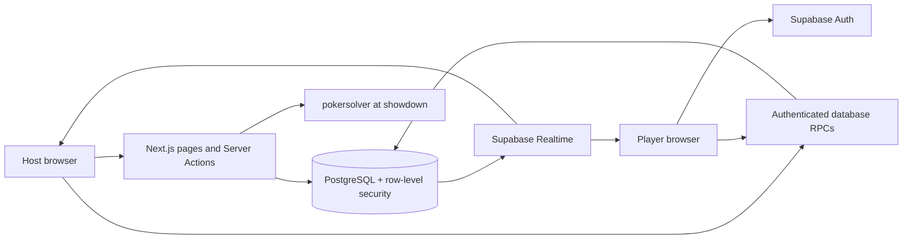

# Architecture and tradeoffs

Poker Ledger combines a home-game ledger with shared poker-table state. The interface runs in Next.js; Supabase supplies authentication, PostgreSQL persistence and realtime change notifications.

## State and correctness

The database owns stacks, commitments, turns, board cards and payouts. Clients request actions instead of calculating and writing their own outcomes. Database row locks serialize operations on a hand; starting and closing games lock the game row. Internal helpers execute only within privileged database functions, not through client RPC access.

Realtime notifications trigger snapshot reads. The client coalesces bursts and serializes reads so overlapping requests cannot finish in reverse order and overwrite newer state. These reads are not a single database snapshot transaction; brief intermediate display states remain possible while multiple tables are fetched. This simple approach fits small home games. At larger scale, a versioned snapshot RPC or event stream would reduce refetch volume and provide stronger rendering consistency.

Guest approval is read from the live roster rather than the server-rendered initial player object. A guest can transition from waiting to approved without refreshing the page.

## Permissions and cards

A guest is a Supabase anonymous Auth user with an identity, not an unsigned-in request. The host approves guests. Players have no general permission to update their roster row; otherwise they could edit approval status and chip balances.

The undealt deck and hole cards live in private tables with client privileges revoked. A scoped RPC returns only the caller's cards. Showdown revelation excludes folded hands. The host evaluation RPC requires the hand to be at showdown. `pokersolver` evaluates the cards in a Server Action; the host reviews the suggested winners and confirms the payout.

The host is deliberately trusted: manual betting overrides and database policies allow administration of their own games. These permissions are unsuitable for a platform where the host must be unable to manipulate outcomes. The current shuffle uses PostgreSQL `random()`; it is not a cryptographic or provably fair shuffle.

## Ledger closeout

`close_live_game` performs validation and writes in a single database transaction:

1. Authenticate the host and lock the game.
2. Reject an unfinished hand or an already-closed game.
3. Validate exact roster coverage and unique player/member mappings.
4. Validate nonnegative amounts with at most two decimal places and member ownership.
5. Create/link members and save results.
6. Require total cash-outs to equal total buy-ins, then finish the game.

Any failure rolls back all writes, including newly created members. Concurrent submissions cannot close the same game twice. A database trigger also prevents a direct status update from closing a game with an unfinished hand.

Manual historical game entry retains its explicit imbalance warning and permits saving an unbalanced record. Suggested payments use greedy debtor/creditor matching; they are not a global optimization algorithm.

## Scope and next improvements

- Add broader browser automation, reconnect/network-failure tests and accessibility checks.
- Expand poker-rule tests, including short all-in raises, odd-chip allocation and blind-only all-ins.
- Add limits and abuse controls before making anonymous sign-up publicly available.
- Improve test-account cleanup and run integration suites against disposable databases.
- Add pagination and scoped/versioned snapshot reads if game history or traffic grows.
- Home-screen installation is supported by a manifest; offline play is not implemented.
